# Guide des Commandes NMAP

Ce référentiel contient un guide visuel des principales commandes et options de NMAP, l'outil de scan réseau.

## Structure des Commandes

```mermaid
graph TD
    NMAP[NMAP] --> Misc[Divers]
    NMAP --> TargetSpec[Spécification des Cibles]
    NMAP --> HostDisc[Découverte d'Hôtes]
    NMAP --> Output[Sortie]
    NMAP --> ScanTech[Techniques de Scan]
    NMAP --> FirewallIDS[Firewall/IDS Evasion & Spoofing]
    NMAP --> Timing[Timing & Performance]
    NMAP --> PortSpec[Spécification des Ports]
    NMAP --> ServiceVersion[Détection de Version]
    NMAP --> ScriptScan[Scan de Scripts]
    NMAP --> OSDetection[Détection OS]

    Misc --> |help| M1[Afficher l'aide]
    Misc --> |v| M2[Augmenter verbosité]
    Misc --> |privileged| M3[Mode privilégié]

    TargetSpec --> |iL| T1[Liste d'hôtes depuis fichier]
    TargetSpec --> |exclude| T2[Exclure des hôtes]
    TargetSpec --> |randomize| T3[Ordre aléatoire]

    HostDisc --> |Pn| H1[Skip host discovery]
    HostDisc --> |PS| H2[TCP SYN Ping]
    HostDisc --> |PA| H3[TCP ACK Ping]
    HostDisc --> |PU| H4[UDP Ping]

    Output --> |oN| O1[Output normal]
    Output --> |oX| O2[Output XML]
    Output --> |oG| O3[Output Grepable]
    Output --> |v| O4[Verbosité]

    ScanTech --> |sS| S1[TCP SYN Scan]
    ScanTech --> |sT| S2[TCP Connect Scan]
    ScanTech --> |sU| S3[UDP Scan]
    ScanTech --> |sA| S4[TCP ACK Scan]

    FirewallIDS --> |f| F1[Fragmentation]
    FirewallIDS --> |D| F2[Leurre]
    FirewallIDS --> |S| F3[Source IP Spoof]
    FirewallIDS --> |g| F4[Source Port Spoof]

    Timing --> |T0| TI1[Paranoïaque]
    Timing --> |T1| TI2[Furtif]
    Timing --> |T3| TI3[Normal]
    Timing --> |T4| TI4[Agressif]
    Timing --> |T5| TI5[Insensé]

    PortSpec --> |p| P1[Ports spécifiques]
    PortSpec --> |F| P2[Fast Scan]
    PortSpec --> |r| P3[Scan séquentiel]

    ServiceVersion --> |sV| V1[Version Scan]
    ServiceVersion --> |version-light| V2[Scan léger]
    ServiceVersion --> |version-all| V3[Scan intensif]

    ScriptScan --> |sC| SC1[Scripts par défaut]
    ScriptScan --> |script| SC2[Scripts spécifiques]
    ScriptScan --> |script-args| SC3[Arguments de script]

    OSDetection --> |O| OS1[OS Detection]
    OSDetection --> |osscan-guess| OS2[OS Detection agressive]
```

## Utilisation

Ce diagramme présente les principales fonctionnalités de NMAP organisées par catégories. Chaque branche représente un aspect différent de l'outil avec ses options associées.

## Catégories Principales

1. **Divers** : Options générales et d'aide
2. **Spécification des Cibles** : Comment définir les cibles du scan
3. **Découverte d'Hôtes** : Méthodes pour détecter les hôtes actifs
4. **Sortie** : Différents formats de sortie disponibles
5. **Techniques de Scan** : Différentes méthodes de scan
6. **Firewall/IDS Evasion** : Techniques pour contourner les systèmes de sécurité
7. **Timing & Performance** : Contrôle de la vitesse et de l'agressivité du scan
8. **Spécification des Ports** : Options pour le scan de ports
9. **Détection de Version** : Identification des services
10. **Scan de Scripts** : Utilisation des scripts NSE
11. **Détection OS** : Identification des systèmes d'exploitation
