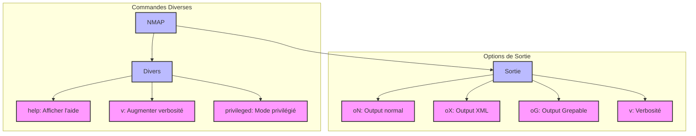

# Commandes de Base NMAP

## Commandes Diverses
- `help` : Afficher la page d'aide
- `v` : Augmenter le niveau de verbosité
- `privileged` : Mode privilégié

## Options de Sortie
- `oN` : Format de sortie normal (texte)
- `oX` : Format XML
- `oG` : Format Grepable
- `v` : Contrôle de la verbosité
