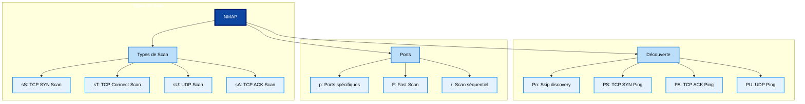

# Techniques de Scan NMAP

## Types de Scan
- `sS` : TCP SYN Scan (furtif)
- `sT` : TCP Connect Scan (complet)
- `sU` : UDP Scan
- `sA` : TCP ACK Scan

## Découverte d'Hôtes
- `Pn` : Ne pas faire de ping
- `PS` : TCP SYN Ping
- `PA` : TCP ACK Ping
- `PU` : UDP Ping

## Spécification des Ports
- `p` : Sélection de ports spécifiques
- `F` : Scan rapide
- `r` : Scan séquentiel
