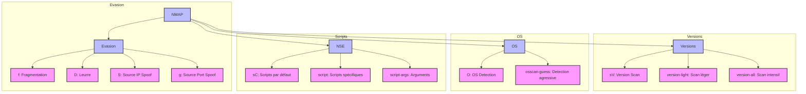

# Fonctionnalités Avancées NMAP

## Evasion de Firewall/IDS
- `f` : Fragmentation des paquets
- `D` : Utilisation de leurres
- `S` : Usurpation d'IP source
- `g` : Usurpation de port source

## Détection de Version
- `sV` : Scan de version standard
- `version-light` : Scan de version rapide
- `version-all` : Scan de version complet

## Détection de Système d'Exploitation
- `O` : Détection d'OS
- `osscan-guess` : Détection agressive

## Scripts NSE
- `sC` : Scripts par défaut
- `script` : Scripts personnalisés
- `script-args` : Arguments de scripts
